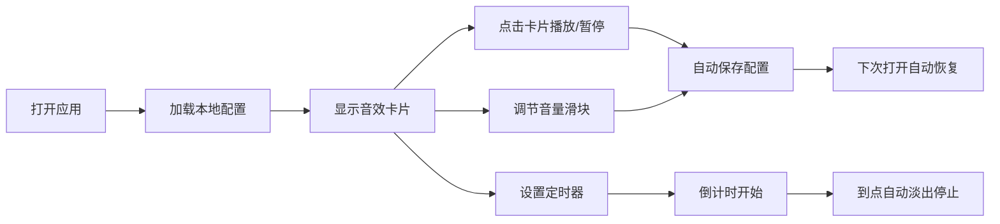

## 1. 产品概述

环境音混音器是一款纯前端的白噪音工具，帮助用户在工作、学习或休息时营造沉浸式的环境氛围。用户可以自由组合多种环境音效（如雨声、海浪、篝火等），独立调节每个声音的音量，创造个性化的听觉体验。

- **核心用途**：放松身心、提升专注力、辅助睡眠
- **目标用户**：需要专注工作的人群、冥想爱好者、睡眠困难者
- **产品价值**：无需后端，打开即用；支持音效自由叠加组合；本地保存用户偏好配置

## 2. 核心功能

### 2.1 功能模块
1. **音效卡片区域**：6种环境音效的独立控制卡片
2. **全局控制区域**：总播放/暂停按钮、定时器设置
3. **偏好存储**：自动保存和加载用户配置

### 2.2 页面详情
| 页面名称 | 模块名称 | 功能描述 |
|---------|---------|---------|
| 主页 | 音效卡片区域 | 展示6种环境音（下雨、海浪、篝火、咖啡馆、风声、鸟叫），每个卡片可点击播放/暂停，独立音量滑块调节 |
| 主页 | 全局控制区域 | 总播放/暂停按钮一键控制所有正在播放的音效；定时器设置（可选预设时长如15/30/60分钟或自定义），到点自动淡出停止 |
| 主页 | 状态持久化 | 自动保存当前音效开关状态和音量配置到 localStorage，下次打开自动恢复 |

## 3. 核心流程

用户打开应用 → 自动加载上次保存的配置 → 点击音效卡片开启/关闭声音 → 拖动滑块调节单个音量 → 可选择设置定时器 → 到点自动淡出停止 → 配置自动保存

## 4. 用户界面设计

### 4.1 设计风格
- **主色调**：柔和的深色系，营造夜晚/静谧氛围，使用深蓝、灰紫渐变
- **辅助色**：柔和的蓝绿色作为高亮/激活状态色
- **按钮风格**：圆角卡片式，玻璃态（glassmorphism）效果，柔和阴影
- **字体**：优雅的无衬线字体，标题稍大，正文简洁
- **布局风格**：居中卡片网格布局，上方全局控制，下方音效网格
- **图标风格**：使用 lucide-react 图标库，简洁线条风格

### 4.2 页面设计概览
| 页面名称 | 模块名称 | UI 元素 |
|---------|---------|---------|
| 主页 | 顶部标题区 | 应用名称、简短副标题、柔和背景渐变 |
| 主页 | 全局控制区 | 大型播放/暂停按钮、定时器选择器、剩余时间显示 |
| 主页 | 音效网格区 | 2×3 或 3×2 响应式网格，每个卡片包含图标、名称、播放状态指示、音量滑块 |
| 主页 | 背景氛围 | 柔和渐变背景、轻微噪点纹理、缓慢呼吸动画 |

### 4.3 响应式设计
- 桌面端优先设计（3×2 六宫格布局）
- 平板端自动适配为 2×3 布局
- 移动端单列纵向排列
- 所有触控目标尺寸适合手指点击

### 4.4 动效设计
- 卡片激活时有柔和的发光效果
- 音量滑块有平滑过渡动画
- 定时器启动时按钮有脉冲动画
- 页面加载时卡片依次淡入
- 停止播放时有淡出过渡效果（3秒渐变衰减）
