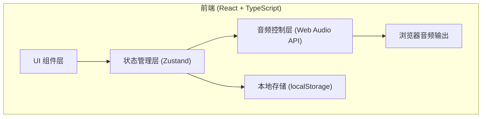

## 1. 架构设计

纯前端单页应用，无后端依赖。使用浏览器原生 Web Audio API 实现音频播放和音量控制，使用 localStorage 进行本地数据持久化。



## 2. 技术选型

- **前端框架**：React 18 + TypeScript
- **构建工具**：Vite
- **样式方案**：Tailwind CSS 3
- **状态管理**：Zustand（轻量级状态管理，适合这种小型应用）
- **图标库**：lucide-react
- **音频方案**：原生 Web Audio API（HTMLAudioElement + GainNode 实现音量控制和淡出效果）
- **数据存储**：浏览器 localStorage
- **初始化工具**：vite-init（react-ts 模板）

## 3. 页面路由定义

| 路由 | 用途 |
|-----|-----|
| / | 主页 - 混音器主界面（唯一页面） |

由于是单页应用，实际上不需要复杂路由，但仍保留 react-router-dom 依赖以备后续扩展。

## 4. 核心数据结构

### 4.1 音效配置数据

```typescript
interface SoundConfig {
  id: string;           // 音效唯一标识
  name: string;         // 音效中文名
  icon: string;         // 图标名称 (lucide)
  audioUrl: string;     // 音频文件 URL（使用公共 CDN 白噪音资源）
  isPlaying: boolean;   // 是否正在播放
  volume: number;       // 音量 0-100
}

interface AppState {
  sounds: SoundConfig[];
  isGlobalPlaying: boolean;  // 全局播放状态
  timerMinutes: number;      // 定时器时长（分钟），0 表示未设置
  timerRemaining: number;    // 定时器剩余秒数
  isTimerRunning: boolean;   // 定时器是否运行中
}
```

### 4.2 本地存储结构

```typescript
interface SavedConfig {
  sounds: { id: string; isPlaying: boolean; volume: number }[];
  savedAt: number;
}
```

## 5. 核心模块划分

### 5.1 组件结构
```
src/
├── components/
│   ├── SoundCard.tsx        # 单个音效卡片组件
│   ├── ControlPanel.tsx     # 全局控制面板（播放/暂停、定时器）
│   ├── VolumeSlider.tsx     # 音量滑块组件
│   └── TimerSelector.tsx    # 定时器选择器
├── hooks/
│   ├── useAudioPlayer.ts    # 音频播放控制 Hook
│   └── useTimer.ts          # 定时器 Hook
├── store/
│   └── useSoundStore.ts     # Zustand 状态管理
├── utils/
│   ├── audio.ts             # 音频处理工具函数（淡出等）
│   └── storage.ts           # localStorage 操作封装
├── data/
│   └── sounds.ts            # 预设音效数据
├── pages/
│   └── Home.tsx             # 主页
├── App.tsx
├── main.tsx
└── index.css
```

### 5.2 关键实现说明

1. **音频播放**：使用 `HTMLAudioElement` 循环播放，配合 Web Audio API 的 `GainNode` 实现独立音量控制和淡出效果
2. **音效资源**：使用免费公共白噪音资源（如 https://cdn.pixabay.com 等 CDN 上的环境音）
3. **状态持久化**：每次状态变更自动写入 localStorage，页面加载时读取恢复
4. **淡出效果**：定时器触发后，使用 `requestAnimationFrame` 在 3 秒内将音量线性衰减到 0，然后停止播放
5. **全局播放/暂停**：记录暂停前哪些声音在播放，恢复时仅恢复之前的状态
